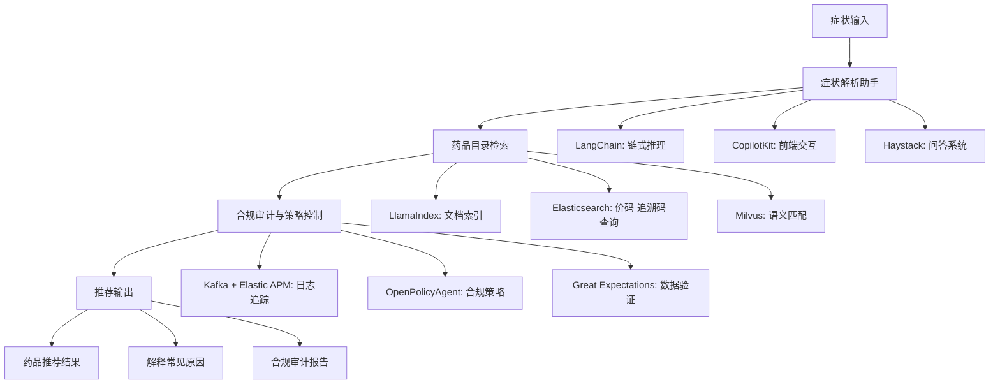
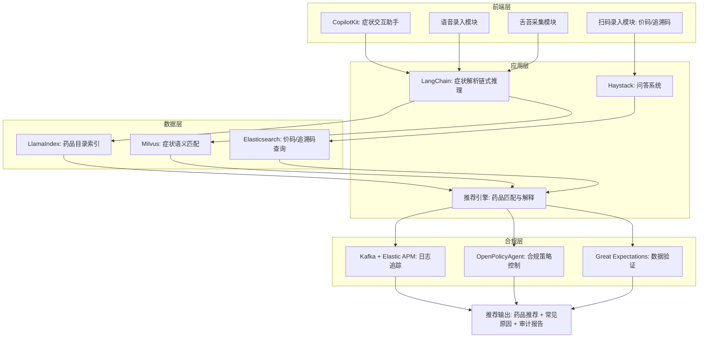

# 架构
## 🏥 药学平台整体架构图 (Markdown + Mermaid)

📊 架构说明
- **症状输入**：用户通过文本、语音或图像（舌苔采集）输入症状。  
- **症状解析助手**：  
  - **LangChain** → 负责链式推理和工具编排。  
  - **CopilotKit** → 嵌入前端，提供交互式助手体验。  
  - **Haystack** → 支持症状与知识库的问答。  
- **药品目录检索**：  
  - **LlamaIndex** → 建立药品目录和说明书索引。  
  - **Elasticsearch** → 快速检索价码、追溯码。  
  - **Milvus** → 提供语义匹配，支持模糊症状检索。  
- **合规审计**：  
  - **Kafka + Elastic APM** → 记录日志，保证可追溯。  
  - **OpenPolicyAgent** → 控制推荐必须在目录内。  
  - **Great Expectations** → 验证药品目录数据一致性。  
- **推荐输出**：  
  - 返回药品推荐结果。  
  - 解释症状可能的常见原因。  
  - 提供合规审计报告。  

📌 总结
👉 这个架构图展示了药学平台的完整工作流：**症状输入 → 症状解析助手 → 药品目录检索 → 合规审计 → 推荐输出**，并且把 **LangChain、CopilotKit、LlamaIndex、Milvus、Elasticsearch、OPA、Kafka** 等工具组合在一起，形成一个合规、可追溯的智能药学平台。  
### 🏥 药学平台分层架构图

📊 架构说明
- **前端层**  
  - **CopilotKit**：嵌入交互式助手。  
  - **语音录入**：采集症状语音并转文本。  
  - **舌苔采集**：图像采集 + 大模型分析。  
  - **扫码录入**：价码与追溯码扫描。  
- **应用层**  
  - **LangChain**：链式推理，解析症状并调用工具。  
  - **Haystack**：问答系统，支持知识库交互。  
  - **推荐引擎**：综合检索结果，生成药品推荐与解释。  
- **数据层**  
  - **LlamaIndex**：药品目录与说明书索引。  
  - **Elasticsearch**：价码与追溯码快速查询。  
  - **Milvus**：语义匹配，支持模糊症状检索。  
- **合规层**  
  - **Kafka + Elastic APM**：日志追踪，保证可追溯。  
  - **OpenPolicyAgent**：合规策略控制，确保推荐合法。  
  - **Great Expectations**：数据验证，保证目录一致性。  

📌 总结
👉 这个分层架构图展示了药学平台的完整工作流：**前端采集 → 应用层解析 → 数据层检索 → 合规层审计 → 推荐输出**，并且把 **CopilotKit、LangChain、LlamaIndex、Milvus、Elasticsearch、OPA、Kafka** 等工具放在合适的层次上，形成一个合规、可追溯的智能药学平台。  

## 