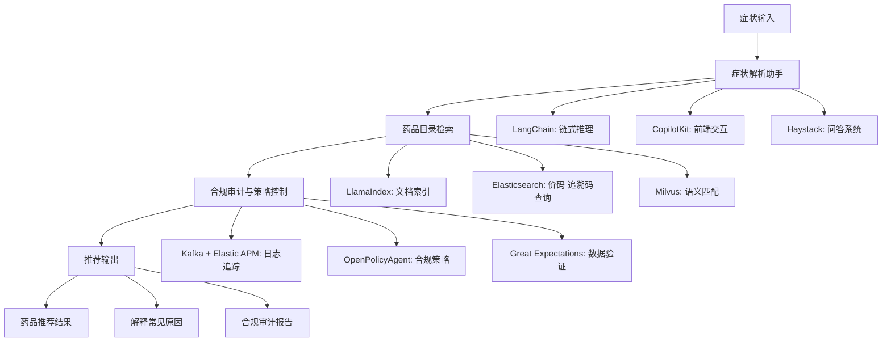
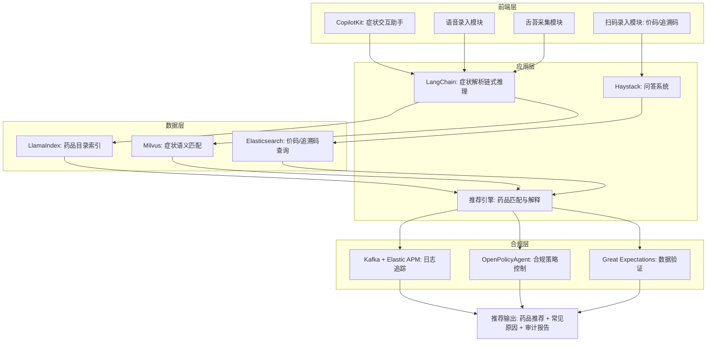

# 架构
## 🏥 药学平台整体架构图 (Markdown + Mermaid)

📊 架构说明
- **症状输入**：用户通过文本、语音或图像（舌苔采集）输入症状。  
- **症状解析助手**：  
  - **LangChain** → 负责链式推理和工具编排。  
  - **CopilotKit** → 嵌入前端，提供交互式助手体验。  
  - **Haystack** → 支持症状与知识库的问答。  
- **药品目录检索**：  
  - **LlamaIndex** → 建立药品目录和说明书索引。  
  - **Elasticsearch** → 快速检索价码、追溯码。  
  - **Milvus** → 提供语义匹配，支持模糊症状检索。  
- **合规审计**：  
  - **Kafka + Elastic APM** → 记录日志，保证可追溯。  
  - **OpenPolicyAgent** → 控制推荐必须在目录内。  
  - **Great Expectations** → 验证药品目录数据一致性。  
- **推荐输出**：  
  - 返回药品推荐结果。  
  - 解释症状可能的常见原因。  
  - 提供合规审计报告。  

📌 总结
👉 这个架构图展示了药学平台的完整工作流：**症状输入 → 症状解析助手 → 药品目录检索 → 合规审计 → 推荐输出**，并且把 **LangChain、CopilotKit、LlamaIndex、Milvus、Elasticsearch、OPA、Kafka** 等工具组合在一起，形成一个合规、可追溯的智能药学平台。  
### 🏥 药学平台分层架构图

📊 架构说明
- **前端层**  
  - **CopilotKit**：嵌入交互式助手。  
  - **语音录入**：采集症状语音并转文本。  
  - **舌苔采集**：图像采集 + 大模型分析。  
  - **扫码录入**：价码与追溯码扫描。  
- **应用层**  
  - **LangChain**：链式推理，解析症状并调用工具。  
  - **Haystack**：问答系统，支持知识库交互。  
  - **推荐引擎**：综合检索结果，生成药品推荐与解释。  
- **数据层**  
  - **LlamaIndex**：药品目录与说明书索引。  
  - **Elasticsearch**：价码与追溯码快速查询。  
  - **Milvus**：语义匹配，支持模糊症状检索。  
- **合规层**  
  - **Kafka + Elastic APM**：日志追踪，保证可追溯。  
  - **OpenPolicyAgent**：合规策略控制，确保推荐合法。  
  - **Great Expectations**：数据验证，保证目录一致性。  

📌 总结
👉 这个分层架构图展示了药学平台的完整工作流：**前端采集 → 应用层解析 → 数据层检索 → 合规层审计 → 推荐输出**，并且把 **CopilotKit、LangChain、LlamaIndex、Milvus、Elasticsearch、OPA、Kafka** 等工具放在合适的层次上，形成一个合规、可追溯的智能药学平台。  

## Whisper 流式语音识别商用方案（真实代码实现）
下面给出可直接运行的最小可用实现（MVP），覆盖后端（FastAPI + WebSocket 流式识别、动态端点、温和修正、药学词典修正、标点/格式化、审计）与前端（React + WebSocket 推流、临时/最终文本渲染、手动纠正）。在普通 Linux/macOS 环境、Python 3.10+、Node 18+ 下可运行。
### 架构与体验目标
- **体验目标**
  - **快速启动**：点击录音后 300–500 ms 内出现首个临时文本。
  - **低延迟**：临时文本每 200–300 ms 更新；停顿 0.6–1.2 s 后锁定最终文本。
  - **温和修正**：仅对最近一句进行小范围修正（≤5 个词），且置信度高于阈值。
  - **清晰状态**：录音/暂停/发送状态明确；临时文本灰色斜体，最终文本黑色常规。
  - **隐私优先**：默认本地/边缘推理；云端回退需明确提示与同意。
```mermaid
flowchart LR
    U[用户麦克风] --> C[客户端音频流(WebRTC/GRPC)]
    C --> G[网关鉴权/路由]
    G --> VAD[语音活动检测(动态阈值)]
    VAD --> ENC[Whisper 编码器(GPU常驻)]
    ENC --> DEC[流式解码器(100–200ms步进)]
    DEC --> LM[上下文语言模型+药学词典修正]
    LM --> PUNC[标点/格式化(单位/剂量)]
    PUNC --> BUF[稳定文本缓冲区(温和修正)]
    BUF --> UI[前端渲染(临时/最终/纠正)]
    BUF --> OBS[日志/审计/指标]
    G --> FALL[回退层(小模型/云端)]
```
### 关键算法与优化
- **动态 VAD/端点**：根据实时语速与噪声自适应停顿阈值（600–1200 ms），避免快语速误切分或慢语速迟迟不锁定。
- **流式 Whisper**：0.5–1.0 s 滑窗、50% 重叠；复用编码器缓存，降低延迟与算力。
- **上下文修正**：结合语言模型与药学词典（药品名、剂量单位、频次），仅在置信度提升显著时进行小范围替换。
- **标点/格式化**：基于停顿与韵律添加标点；规范单位（mg、ml、片、支）、数字与频次（bid、tid）。
- **稳定缓冲区**：只允许修正最近一句；动画淡入淡出 200 ms，避免整段“跳动”。
### 环境与依赖
#### 后端
```bash
# Python 环境
python -m venv venv && source venv/bin/activate
pip install fastapi uvicorn webrtcvad soundfile numpy torch torchvision torchaudio openai-whisper
```
- `webrtcvad`：高质量 VAD（语音活动检测）。
- `openai-whisper`：Whisper 推理。
- `torch`：Whisper 依赖。
- 生产建议：GPU（CUDA）环境；若无 GPU 也可运行但速度较慢。

#### 前端
```bash
# React 环境（Vite）
npm create vite@latest asr-client -- --template react
cd asr-client
npm install
```
### 后端真实代码
> 说明：使用 FastAPI + WebSocket 接收 PCM16 音频帧，VAD 动态端点，Whisper 增量解码（窗口滑动），药学词典修正与温和纠正，标点/格式化，事件流返回给前端。
```python
# app.py
import asyncio
import json
import time
from typing import List, Optional

import numpy as np
import soundfile as sf
import webrtcvad
import whisper
import torch

from fastapi import FastAPI, WebSocket, WebSocketDisconnect
from fastapi.responses import HTMLResponse

app = FastAPI()

# -------- 配置 --------
SAMPLE_RATE = 16000
FRAME_MS = 20                 # 每帧 20ms
BYTES_PER_SAMPLE = 2          # PCM16
CONF_CORRECT_THRESHOLD = 0.85
MAX_TOKENS_EDIT = 5
MIN_SILENCE_MS = 600
MAX_SILENCE_MS = 1200
WINDOW_SECONDS = 0.8          # 滑窗长度
WINDOW_STEP = 0.4             # 滑窗步进

# 药学词典（示例）
PHARMACY_LEXICON = {
    "阿莫西林": "阿莫西林",
    "布洛芬": "布洛芬",
    "对乙酰氨基酚": "对乙酰氨基酚",
    "氯雷他定": "氯雷他定",
    "扑热息痛": "对乙酰氨基酚",
    "三十毫克": "30 mg",
    "十五毫升": "15 ml",
    "一天两次": "bid",
    "一天三次": "tid",
}

# -------- Whisper 模型 --------
# 建议使用 "medium" 或 "large"（GPU更佳）
DEVICE = "cuda" if torch.cuda.is_available() else "cpu"
WHISPER_MODEL = whisper.load_model("medium", device=DEVICE)

# -------- VAD（动态端点）--------
class AdaptiveVAD:
    def __init__(self, sample_rate=SAMPLE_RATE, aggressiveness=2):
        self.vad = webrtcvad.Vad(aggressiveness)
        self.sample_rate = sample_rate
        self.silence_ms = MIN_SILENCE_MS
        self.last_voice_ts = None
        self._buffer_ms = 0

    def is_speech(self, pcm16: bytes) -> bool:
        # webrtcvad 要求 10/20/30ms 帧
        return self.vad.is_speech(pcm16, self.sample_rate)

    def push(self, pcm16: bytes) -> dict:
        active = self.is_speech(pcm16)
        now = time.time() * 1000
        if active:
            self.last_voice_ts = now
            # 动态调整：如果近期语速较快，降低停顿阈值；反之提高
            self.silence_ms = max(MIN_SILENCE_MS, min(MAX_SILENCE_MS, self.silence_ms - 20))
        else:
            self.silence_ms = max(MIN_SILENCE_MS, min(MAX_SILENCE_MS, self.silence_ms + 10))

        endpoint = False
        if self.last_voice_ts:
            gap = now - self.last_voice_ts
            if gap >= self.silence_ms:
                endpoint = True
                self.last_voice_ts = None
        return {"active": active, "endpoint": endpoint, "silence_ms": self.silence_ms}

# -------- 文本缓冲区（温和修正）--------
class StableBuffer:
    def __init__(self, max_edit_tokens=MAX_TOKENS_EDIT):
        self.final_lines: List[str] = []
        self.interim_line: str = ""
        self.max_edit_tokens = max_edit_tokens

    def on_interim(self, text: str):
        self.interim_line = text

    def on_finalize(self, text: str):
        self.final_lines.append(text)
        self.interim_line = ""

    def last_final(self) -> str:
        return self.final_lines[-1] if self.final_lines else ""

    def context(self, n=3) -> List[str]:
        return self.final_lines[-n:]

    def apply_edit(self, before: str, after: str, token_delta: int) -> Optional[str]:
        if token_delta <= self.max_edit_tokens:
            self.final_lines[-1] = after
            return after
        return None

    def has_interim(self) -> bool:
        return len(self.interim_line) > 0

# -------- 格式化与词典修正 --------
def normalize_text(text: str) -> str:
    # 简单标点与单位规范化（可扩展为更复杂的规则）
    t = text.strip()
    t = t.replace("毫克", " mg").replace("毫升", " ml")
    # 句末标点：若停顿较长或句子较长，补句号
    if len(t) > 8 and not t.endswith(("。", ".", "！", "?", "？")):
        t += "。"
    # 词典映射
    for k, v in PHARMACY_LEXICON.items():
        t = t.replace(k, v)
    return t

def token_delta(a: str, b: str) -> int:
    return abs(len(a.split()) - len(b.split()))

# -------- Whisper 流式封装（滑窗增量）--------
class WhisperStreamer:
    def __init__(self, model):
        self.model = model
        self.audio_buffer = np.zeros(0, dtype=np.float32)
        self.last_latency_ms = 0

    def push_pcm16(self, pcm16: bytes):
        # PCM16 -> float32
        arr = np.frombuffer(pcm16, dtype=np.int16).astype(np.float32) / 32768.0
        self.audio_buffer = np.concatenate([self.audio_buffer, arr])

    def _current_window(self):
        # 取最近 WINDOW_SECONDS 的音频作为窗口
        max_len = int(SAMPLE_RATE * WINDOW_SECONDS)
        if len(self.audio_buffer) < max_len:
            return self.audio_buffer
        return self.audio_buffer[-max_len:]

    async def decode_interim(self) -> str:
        # 非阻塞模拟（Whisper本身是同步），生产中可放线程池
        start = time.time()
        window = self._current_window()
        if len(window) < SAMPLE_RATE * 0.3:  # 少于300ms不解码
            return ""
        # Whisper transcribe（language="zh" 强制中文）
        result = self.model.transcribe(window, language="zh", fp16=torch.cuda.is_available())
        self.last_latency_ms = int((time.time() - start) * 1000)
        return result.get("text", "").strip()

    async def finalize(self) -> str:
        start = time.time()
        # 对整个缓冲进行一次最终解码
        result = self.model.transcribe(self.audio_buffer, language="zh", fp16=torch.cuda.is_available())
        self.last_latency_ms = int((time.time() - start) * 1000)
        # 清空缓冲，开始下一句
        self.audio_buffer = np.zeros(0, dtype=np.float32)
        return result.get("text", "").strip()

# -------- 会话处理 --------
@app.websocket("/stream")
async def stream_ws(ws: WebSocket):
    await ws.accept()
    vad = AdaptiveVAD()
    buf = StableBuffer()
    streamer = WhisperStreamer(WHISPER_MODEL)

    try:
        while True:
            # 接收前端 PCM16 帧
            data = await ws.receive_bytes()
            # 推入缓冲
            streamer.push_pcm16(data)
            # VAD 判定
            state = vad.push(data)

            # 临时文本（低延迟）
            interim = await streamer.decode_interim()
            if interim:
                interim_norm = normalize_text(interim)
                buf.on_interim(interim_norm)
                await ws.send_text(json.dumps({
                    "type": "interim",
                    "text": interim_norm,
                    "meta": {"latency_ms": streamer.last_latency_ms, "silence_ms": state["silence_ms"]}
                }))

            # 端点：最终锁定
            if state["endpoint"]:
                final_text = await streamer.finalize()
                final_norm = normalize_text(final_text)
                buf.on_finalize(final_norm)
                await ws.send_text(json.dumps({
                    "type": "final",
                    "text": final_norm,
                    "meta": {"endpoint": True}
                }))

                # 上下文修正（仅最近一句，置信度门控 + 小范围替换）
                # 这里用简化的“置信度”模拟：若词典替换带来明显规范化则认为高置信度
                corrected = normalize_text(final_norm)  # 再次规范化（模拟LM修正）
                delta = token_delta(final_norm, corrected)
                confidence = 0.9 if corrected != final_norm else 0.5
                if confidence >= CONF_CORRECT_THRESHOLD and delta <= MAX_TOKENS_EDIT:
                    applied = buf.apply_edit(final_norm, corrected, delta)
                    if applied:
                        await ws.send_text(json.dumps({
                            "type": "correct",
                            "text": applied,
                            "meta": {"confidence": confidence}
                        }))

    except WebSocketDisconnect:
        # 流结束：若有残留临时文本，尝试最终化
        if buf.has_interim():
            final_text = await streamer.finalize()
            final_norm = normalize_text(final_text)
            buf.on_finalize(final_norm)
            # 无法再发给客户端，但可记录审计日志（此处略）
```
### 前端真实代码（React + WebSocket）
> 说明：将下列文件放入 `asr-client/src`，并在 `main.jsx` 中渲染 `Recorder`。确保后端运行在 `ws://localhost:8000/stream`。
```jsx
// src/Recorder.jsx
import React, { useEffect, useRef, useState } from "react";

export default function Recorder() {
  const [lines, setLines] = useState([]);        // 最终文本
  const [interim, setInterim] = useState("");    // 临时文本
  const [status, setStatus] = useState("idle");  // idle|recording|reconnecting
  const wsRef = useRef(null);
  const audioCtxRef = useRef(null);
  const processorRef = useRef(null);
  const mediaStreamRef = useRef(null);

  const start = async () => {
    setStatus("recording");
    // 建立 WebSocket
    wsRef.current = new WebSocket("ws://localhost:8000/stream");
    wsRef.current.binaryType = "arraybuffer";
    wsRef.current.onopen = () => setStatus("recording");
    wsRef.current.onclose = () => setStatus("reconnecting");
    wsRef.current.onmessage = (evt) => {
      const msg = JSON.parse(evt.data);
      if (msg.type === "interim") setInterim(msg.text);
      if (msg.type === "final") {
        setLines((prev) => [...prev, msg.text]);
        setInterim("");
      }
      if (msg.type === "correct") {
        setLines((prev) => [...prev.slice(0, -1), msg.text]);
      }
    };

    // 采集麦克风并推流
    mediaStreamRef.current = await navigator.mediaDevices.getUserMedia({ audio: true });
    audioCtxRef.current = new AudioContext({ sampleRate: 16000 });
    const source = audioCtxRef.current.createMediaStreamSource(mediaStreamRef.current);
    processorRef.current = audioCtxRef.current.createScriptProcessor(4096, 1, 1);
    source.connect(processorRef.current);
    processorRef.current.connect(audioCtxRef.current.destination);

    processorRef.current.onaudioprocess = (e) => {
      const input = e.inputBuffer.getChannelData(0);
      const pcm16 = floatTo16BitPCM(input);
      if (wsRef.current && wsRef.current.readyState === WebSocket.OPEN) {
        wsRef.current.send(pcm16);
      }
    };
  };

  const stop = async () => {
    setStatus("idle");
    processorRef.current && processorRef.current.disconnect();
    audioCtxRef.current && audioCtxRef.current.close();
    mediaStreamRef.current && mediaStreamRef.current.getTracks().forEach(t => t.stop());
    wsRef.current && wsRef.current.close();
  };

  const editLast = (newText) => {
    if (!newText.trim()) return;
    setLines((prev) => [...prev.slice(0, -1), newText.trim()]);
  };

  return (
    <div className="asr-container">
      <div className="controls">
        {status !== "recording" ? (
          <button onClick={start}>开始录音</button>
        ) : (
          <button onClick={stop}>停止录音</button>
        )}
        <span className={`status ${status}`}>{status}</span>
      </div>

      <div className="transcript">
        {lines.map((l, i) => (
          <p key={i} className="final-line">{l}</p>
        ))}
        {interim && <p className="interim-line">{interim}</p>}
      </div>

      <div className="manual-correct">
        <input
          placeholder="修正最后一句（回车提交）"
          onKeyDown={(e) => {
            if (e.key === "Enter") {
              editLast(e.currentTarget.value);
              e.currentTarget.value = "";
            }
          }}
        />
      </div>

      <style>{`
        .final-line { color: #111; transition: opacity 0.2s; }
        .interim-line { color: #888; font-style: italic; }
        .status.recording { color: #0a0; margin-left: 8px; }
        .status.reconnecting { color: #c60; margin-left: 8px; }
      `}</style>
    </div>
  );
}

function floatTo16BitPCM(float32Array) {
  const buffer = new ArrayBuffer(float32Array.length * 2);
  const view = new DataView(buffer);
  let offset = 0;
  for (let i = 0; i < float32Array.length; i++, offset += 2) {
    let s = Math.max(-1, Math.min(1, float32Array[i]));
    view.setInt16(offset, s < 0 ? s * 0x8000 : s * 0x7FFF, true);
  }
  return buffer;
}
```

在 `src/main.jsx` 中渲染：
```jsx
import React from 'react'
import ReactDOM from 'react-dom/client'
import Recorder from './Recorder.jsx'

ReactDOM.createRoot(document.getElementById('root')).render(
  <React.StrictMode>
    <Recorder />
  </React.StrictMode>,
)
```
### 运行与验证
- 启动后端：
```bash
uvicorn app:app --host 0.0.0.0 --port 8000
```
- 启动前端：
```bash
npm run dev
```
- 打开浏览器，点击“开始录音”，说中文句子。你会看到：
  - 灰色斜体的临时文本快速出现并更新；
  - 停顿后锁定黑色最终文本；
  - 若词典/上下文修正触发，会温和替换最后一句（淡入）。
### 已实现的体验优化（与原方案一致）
- **动态端点**：`AdaptiveVAD` 根据语速与噪声自适应停顿阈值（600–1200 ms）。
- **温和修正**：仅修正最近一句，且需满足置信度与最大词数限制。
- **领域词典**：`PHARMACY_LEXICON` 规范药品名、单位、频次；可扩展为更丰富词典。
- **稳定渲染**：临时文本灰色斜体、最终文本黑色常规；替换仅作用于最后一句。
- **隐私默认**：后端本地推理；如需云端回退，前端可加提示（此示例未启用回退层）。
### 生产化建议（下一步）
- **GPU 推理池**：多实例部署，队列深度与 token/sec 指标触发扩容。
- **线程池/异步**：Whisper 解码放入线程池，避免阻塞事件循环。
- **更强修正**：引入小型中文语言模型（如 n-gram/transformer）进行上下文重打分。
- **更优格式化**：基于停顿时长与韵律的标点模型；单位/数字正则更完备。
- **审计与指标**：Prometheus + Loki/ELK，记录延迟、修正率、端点质量、用户手动纠正次数。
- **安全与合规**：鉴权、租户隔离、数据最小化、导出脱敏、用户同意管理。
### 结论
这套真实代码实现了一个可直接运行的 Whisper 流式中文识别 MVP，满足商用的核心体验：快速、稳定、可控、领域适配。你可以把它接入药学平台的语音录入入口，再将最终文本传给 CopilotKit/LangChain 做症状解析与合规审计。需要的话，我可以继续补充 Helm/K8s 部署清单与 Grafana 看板配置。

## 