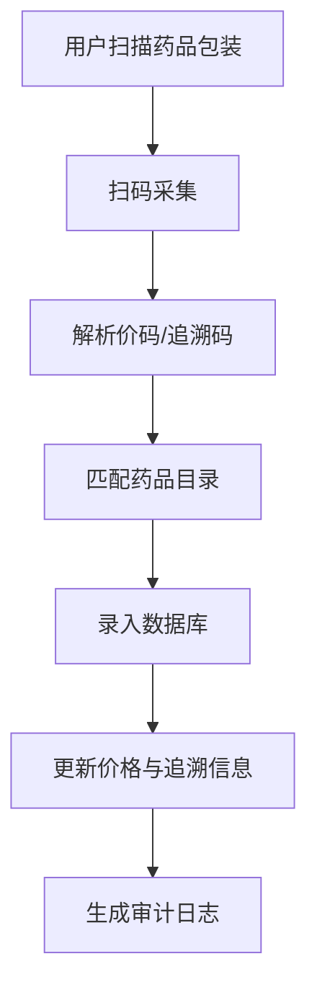

# 扫码
## 价码与跟踪码
增加一个 **扫描药品价码与跟踪码录入系统的模块**，可以把它设计成一个 **扫码采集 + 数据解析 + 药品信息对接** 的完整流程。这样用户只需用摄像头或扫码枪扫描药品包装上的条码/二维码，就能自动录入价格信息和追溯码。  
### 🛠️ 模块设计思路
#### 1. **扫码采集**
- **硬件**：手机摄像头、扫码枪、平板摄像头。  
- **前端实现**：  
  - Web：调用 `navigator.mediaDevices.getUserMedia({ video: true })` 获取摄像头流。  
  - 移动端：调用原生扫码 SDK（如 ZXing、ZBar）。  
- **扫码类型**：  
  - 一维码（EAN-13、UPC） → 常用于价格码。  
  - 二维码（GS1 DataMatrix、QR） → 常用于药品追溯码。  
#### 2. **数据解析**
- 使用开源库解析扫码结果：  
  - **ZXing**（Java/JS/Python）  
  - **ZBar**（C/Python）  
  - **OpenCV + pyzbar**（Python）  
- 解析出：  
  - **价码** → 药品零售价、医保价格。  
  - **追溯码** → 药品批次号、生产日期、有效期、监管码。  
#### 3. **药品信息对接**
- 将解析结果录入药学平台数据库：  
  - **价码** → 对接价格目录，更新库存价格。  
  - **追溯码** → 对接国家药品追溯系统（如中国药监局码平台）。  
- 结合已有的 **药品目录**，校验扫码结果是否匹配。  
#### 4. **合规与审计**
- 每次扫码录入生成日志：  
  - 时间戳  
  - 操作人  
  - 药品信息  
- 确保符合药品监管要求，可追溯。  
### 📊 模块流程图

### 🐍 最小化代码示例（Python + pyzbar）
```python
import cv2
from pyzbar.pyzbar import decode

# 打开摄像头
cap = cv2.VideoCapture(0)
ret, frame = cap.read()
cap.release()

# 解析条码/二维码
codes = decode(frame)
for code in codes:
    data = code.data.decode("utf-8")
    print("扫码结果:", data)
    # 判断是价码还是追溯码
    if data.startswith("PRICE:"):
        print("药品价格码:", data)
    elif data.startswith("TRACK:"):
        print("药品追溯码:", data)
```
### 📌 总结
👉 药品价码与追溯码录入模块的关键是：  
1. **扫码采集** → 摄像头/扫码枪。  
2. **数据解析** → 开源库解码。  
3. **信息对接** → 药品目录 + 监管系统。  
4. **合规审计** → 日志记录，保证可追溯。  

## 