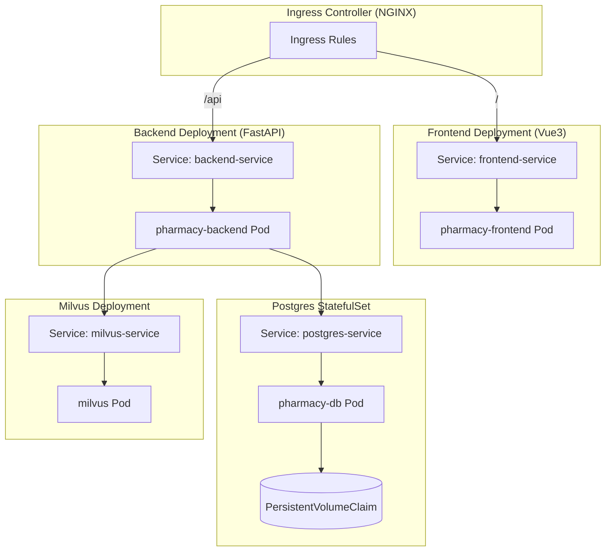

# 规格
## 智能售药平台方案规格
来把整个智能售药平台的方案梳理成一份 **规格说明书**，涵盖功能、技术选型、架构、部署、合规要求等关键点。这样你就能一目了然地看到系统的全貌。
### 1. 功能规格
- **药品检索工具**
  - 从库存系统获取药品名称。
  - 调用大模型生成药品基础信息（适应症、禁忌、处方属性、红旗标识、说明）。
  - 将药品信息嵌入向量并存入 Milvus。
  - 提供语义检索接口。
- **规则引擎工具**
  - 对候选药品进行禁忌检查（妊娠、肝病等）。
  - 判断是否处方药，需上传处方或药师复核。
  - 红旗标识提示（高热、症状持续时间等）。
  - 返回决策：允许 / 阻止 / 药师复核。
- **症状解析工具**
  - 输入症状文本，调用检索工具获取候选药品。
  - 使用规则引擎过滤，得到药品最小集。
  - 调用大模型生成用药清单（JSON 格式）。
  - 查询库存与价格，计算会员折扣。
  - 生成订单，返回支付二维码与应付款金额。
  - 模拟支付接口 `/pay`，返回支付成功/失败。
### 2. 技术规格
- **开发语言**：后端 Python (FastAPI)，前端 Vue3。
- **大模型**：DeepSeek Chat + DeepSeek Embedding。
- **MCP 框架**：LangChain，用于工具编排与审计。
- **数据库**：Postgres (库存、价格、订单、会员、审计日志)。
- **向量库**：Milvus (药品语义检索)。
- **ORM**：SQLAlchemy。
- **容器化**：Docker + Kubernetes。
- **部署管理**：Helm Chart。
### 3. 架构规格
- **前端**：Vue3 + Router，页面包括：
  - `/` 药品检索
  - `/symptom` 症状解析
  - `/checkout` 订单结算
- **后端服务**：
  - API 网关：统一鉴权、审计。
  - 药品检索工具：Milvus + Embedding。
  - 规则引擎工具：禁忌/处方/红旗。
  - 症状解析工具：候选药品 → 规则过滤 → Chat 推理 → 用药清单。
  - 订单与支付：库存/价格查询、折扣计算、生成订单、支付二维码。
- **数据流**：
  - 药品名称 → DeepSeek Chat → 药品信息 → Milvus。
  - 症状 → Milvus 检索 → 规则引擎 → DeepSeek Chat → 用药清单 → Postgres → 支付。
### 4. 部署规格
- **Kubernetes 部署**：
  - 后端 Deployment + Service。
  - 前端 Deployment + Service。
  - Postgres StatefulSet + PVC。
  - Milvus Deployment + Service。
  - Ingress 路由：`/api` → 后端，`/` → 前端。
- **Helm Chart**：
  - 参数化镜像、端口、数据库配置、Ingress。
  - 支持副本数调整、资源限制。
- **初始化脚本**：
  - `bootstrap.sh`：支持 `--reset` 重置环境，`--seed-only` 导入数据。
  - `seed.py`：仅提供药品名称清单，调用大模型生成药品信息并写入 Milvus。
### 5. 合规与安全规格
- **角色与权限**：会员、店员、药师、管理员。
- **处方管理**：上传处方、药师复核、留存与审计。
- **数据最小化**：仅保留必要健康信息，敏感字段加密。
- **可解释性**：模型输出附带提示词摘要与规则命中点。
- **风控**：高风险症状强制建议线下就医；频繁购买触发人工复核。
- **日志与追溯**：工具调用、模型响应、规则决策、订单变更全量打点。
### 6. 支付规格
- **订单生成**：
  - 计算应付款金额（含折扣）。
  - 返回订单号、总金额。
- **支付二维码**：
  - 返回支付链接（如 `/pay?order_id=xxx&amount=yyy`）。
  - 前端用支付链接生成二维码。
- **模拟支付接口**：
  - `/pay` 接口，返回支付成功/失败。
  - 可扩展为 POST 请求，更新订单状态。
### 7. 扩展规格
- **生产环境 values-production.yaml**：副本数更多、资源限制更严格。
- **Alembic 迁移**：数据库版本管理。
- **规则配置中心**：禁忌/红旗规则抽象为 JSON Schema，支持管理后台。
- **支付网关对接**：可替换模拟支付为支付宝/微信/Stripe。

✅ 总结：这套规格涵盖了 **功能、技术、架构、部署、合规、安全、支付** 全链路，既能快速原型验证，也能扩展到生产环境。  

## **系统架构图**
```mermaid
flowchart TD

    subgraph Frontend["前端Vue3"]
        A1[Search 页面]
        A2[Symptom 页面]
        A3[Checkout 页面]
    end

    subgraph Backend["后端:FastAPI+LangChain"]
        B1[药品检索工具\n\(Milvus + Embedding\)]
        B2[规则引擎工具\n(禁忌\/处方\/红旗)]
        B3[症状解析工具\n\(Chat 推理链路\)]
        B4[订单与支付\n库存\/价格\/折扣\/二维码]
        B5[模拟支付接口 \/pay]
    end

    subgraph DB["数据库 \(Postgres\)"]
        C1[药品表]
        C2[库存表]
        C3[价格表]
        C4[订单表]
        C5[审计日志]
    end

    subgraph VectorDB["向量库\(Milvus\)"]
        D1[药品向量集合]
    end

    subgraph LLM["大模型\(DeepSeek\)"]
        E1[Embedding API]
        E2[Chat API]
    end

    %% 前端调用后端
    A1 -->|药品搜索| B1
    A2 -->|症状解析| B3
    A3 -->|订单查询| B4

    %% 后端调用数据库与向量库
    B1 --> D1
    B3 --> B1
    B3 --> B2
    B3 --> E2
    B4 --> C2
    B4 --> C3
    B4 --> C4
    B4 --> B5

    %% 向量库依赖 Embedding
    B1 --> E1

    %% 审计日志
    Backend --> C5
```
### **说明**
- **前端**：Vue3 路由拆分为 Search、Symptom、Checkout 三个页面。  
- **后端**：FastAPI 提供工具接口，LangChain 负责工具编排与审计。  
- **数据库**：Postgres 存储药品、库存、价格、订单、审计日志。  
- **向量库**：Milvus 存储药品语义向量，支持检索。  
- **大模型**：DeepSeek Embedding 用于向量生成，DeepSeek Chat 用于症状解析和用药清单生成。  
- **支付**：订单生成后返回支付二维码链接，调用 `/pay` 模拟支付接口。  

## **部署架构图**

### **说明**
- **Ingress Controller**：负责路由流量，`/` 转发到前端，`/api` 转发到后端。  
- **Frontend (Vue3)**：通过 `frontend-service` 暴露，用户访问 UI。  
- **Backend (FastAPI)**：通过 `backend-service` 暴露，处理 API 请求。  
- **Postgres**：使用 StatefulSet 部署，带 PVC 持久化存储，保存药品、库存、订单等数据。  
- **Milvus**：部署为向量数据库，存储药品语义向量，供后端检索。  
- **Helm Chart**：将这些 Deployment、Service、StatefulSet、Ingress 打包成参数化配置，方便部署和升级。  

这样你就能直观地看到 **Kubernetes/Helm 部署关系**，从入口到前端、后端，再到数据库和向量库的完整链路。  

好的，我们来画一份 **数据流架构图 (Mermaid)**，展示用户输入症状到生成订单和支付的完整链路。  

---

## 数据流架构图
```mermaid
flowchart TD

    U[用户输入症状] --> FE[前端 Vue3 Symptom 页面]

    FE --> API[后端 FastAPI /symptom/plan]

    subgraph Backend["后端服务链路"]
        API --> DS[药品检索工具\n(Milvus + Embedding)]
        DS --> RE[规则引擎工具\n禁忌/处方/红旗]
        RE --> CHAT[症状解析工具\nDeepSeek Chat 推理]
        CHAT --> PLAN[生成用药清单(JSON)]
        PLAN --> PI[库存与价格查询\nSQLAlchemy ORM]
        PI --> ORD[订单生成\n计算应付款金额]
        ORD --> PAY[支付二维码链接]
        PAY --> SIM[模拟支付接口 /pay]
    end

    subgraph DB["Postgres 数据库"]
        PI --> INV[库存表]
        PI --> PRC[价格表]
        ORD --> ODR[订单表]
        Backend --> AUD[审计日志]
    end

    subgraph VectorDB["Milvus 向量库"]
        DS --> VEC[药品向量集合]
    end

    subgraph LLM["大模型 DeepSeek"]
        DS --> EMB[Embedding API]
        CHAT --> CHATAPI[Chat API]
    end

    SIM --> FEOUT[前端 Checkout 页面]
    FEOUT --> UOUT[用户查看订单与支付结果]
```
### **说明**
- **用户输入症状**：在前端 Symptom 页面提交。  
- **后端链路**：
  - 药品检索工具：调用 Milvus + Embedding，获取候选药品。  
  - 规则引擎工具：过滤禁忌、处方药、红旗提示。  
  - 症状解析工具：调用 DeepSeek Chat，生成用药清单 JSON。  
  - 库存与价格查询：查询 Postgres，计算会员折扣。  
  - 订单生成：写入订单表，计算应付款金额。  
  - 支付二维码：生成支付链接。  
  - 模拟支付接口：返回支付成功/失败。  
- **数据库**：存储库存、价格、订单、审计日志。  
- **向量库**：存储药品语义向量。  
- **大模型**：DeepSeek Embedding + Chat 提供语义检索和推理。  
- **前端 Checkout 页面**：展示订单详情、应付款金额、支付二维码。  

这样你就能清晰看到从 **症状输入 → 药品检索 → 规则过滤 → Chat 推理 → 用药清单 → 库存价格 → 订单生成 → 支付** 的完整数据流。  

## 
