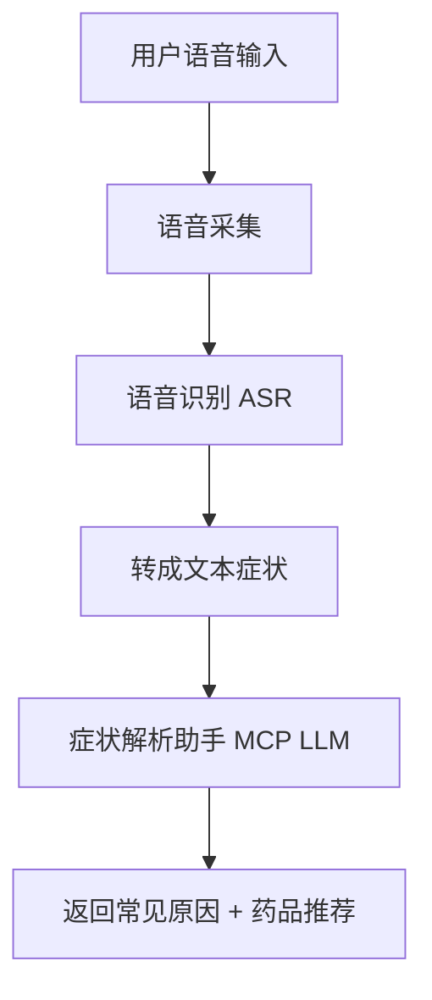

# 语音识别
## 语音录入症状
**增加一个语音录入症状的模块**，可以分成三个层次来实现：**语音采集 → 语音识别 → 症状解析**。这样用户就能直接说出症状，系统自动转成文本并进入你的症状解析逻辑。  
### 🛠️ 模块设计思路
#### 1. **语音采集**
- 前端（Web/App）调用麦克风，采集用户语音。  
- 常见技术：
  - Web：`navigator.mediaDevices.getUserMedia({ audio: true })`  
  - 移动端：Android/iOS 原生语音录制 API。  
#### 2. **语音识别（ASR）**
- 将语音转成文本。可选方案：
  - **开源**：  
    - [OpenAI Whisper](https://github.com/openai/whisper)（支持多语言，准确率高）。  
    - Vosk、Kaldi（轻量级，适合离线）。  
  - **云服务**：  
    - Azure Speech Service  
    - Google Speech-to-Text  
    - 阿里云/科大讯飞语音识别  
#### 3. **症状解析**
- 将识别出的文本传入你已有的 **症状解析助手（MCP + 大模型）**。  
- 系统提示（system prompt）保持不变：解释常见原因 + 推荐药品（限定目录）。  
### 📊 模块流程图

### 🐍 最小化代码示例（Python + Whisper）
```python
import whisper

# 1. 加载模型
model = whisper.load_model("base")

# 2. 语音文件转文本
result = model.transcribe("symptom_audio.wav", language="zh")
text = result["text"]

# 3. 将文本传入症状解析助手
print(f"识别到的症状: {text}")
# 接下来调用你的大模型 Agent，传入 text 和药品目录
```
### 📌 总结
👉 增加语音录入模块的关键是：  
1. **采集语音**（前端/移动端）。  
2. **识别语音**（Whisper 或云服务）。  
3. **传入症状解析助手**（结合你已有的药品推荐逻辑）。  

## 