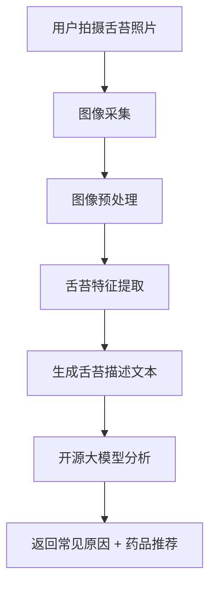

# 舌苔
## 舌苔分析
要在药学平台里增加一个 **采集舌苔并使用开源大模型进行分析的模块**，可以把它设计成一个 **图像采集 + 图像识别 + 大模型解析** 的完整流程。这样用户拍摄舌苔照片后，系统就能自动识别特征并结合药学知识进行分析。  
### 🛠️ 模块设计思路
#### 1. **舌苔采集**
- 前端调用摄像头拍摄舌苔照片。  
- 技术实现：
  - Web：`navigator.mediaDevices.getUserMedia({ video: true })`  
  - 移动端：调用手机摄像头 API。  
- 要求：清晰、光线充足，避免遮挡。  
#### 2. **图像预处理**
- 对采集的舌苔图像进行标准化处理：  
  - 裁剪舌头区域  
  - 调整亮度/对比度  
  - 去除背景干扰  
- 可用 **OpenCV** 或 **Pillow** 实现。  
#### 3. **特征提取**
- 提取舌苔的关键特征：  
  - **颜色**（淡红、深红、黄、白）  
  - **厚薄**（薄苔、厚苔）  
  - **润燥**（润泽、干燥）  
  - **分布**（均匀、不均匀）  
- 可用 **CNN / Vision Transformer** 或 **开源模型**（如 CLIP、ResNet）进行分类。  
#### 4. **大模型分析**
- 将提取的特征转成结构化文本描述：  
  - 例如：“舌苔偏黄，厚腻，伴有干燥”。  
- 输入到开源大模型（如 **LLaVA、BLIP-2、Qwen-VL** 等视觉语言模型），结合药学知识库进行解释。  
- 输出：可能的常见原因 + 推荐药品（限定目录）。  
### 📊 模块流程图

### 🐍 最小化代码示例（Python + OpenCV + HuggingFace）
```python
import cv2
from transformers import pipeline

# 1. 采集舌苔图像
cap = cv2.VideoCapture(0)
ret, frame = cap.read()
cv2.imwrite("tongue.jpg", frame)
cap.release()

# 2. 使用开源大模型进行图像分析（示例：BLIP-2）
analyzer = pipeline("image-to-text", model="Salesforce/blip2-flan-t5-xl")
result = analyzer("tongue.jpg")

# 3. 输出舌苔描述
tongue_desc = result[0]["generated_text"]
print("舌苔分析结果:", tongue_desc)

# 4. 将描述传入药学症状解析助手（结合药品目录）
# 例如：调用你的大模型 Agent，输入症状 + 舌苔描述
```
### 📌 总结
👉 舌苔采集与分析模块的关键是：  
1. **采集图像** → 摄像头拍摄。  
2. **预处理** → 标准化舌苔区域。  
3. **特征提取** → 颜色、厚薄、润燥、分布。  
4. **大模型分析** → 用开源视觉语言模型解释并结合药学推荐。  

## 